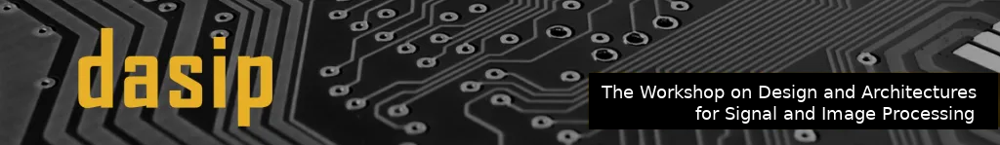
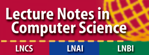
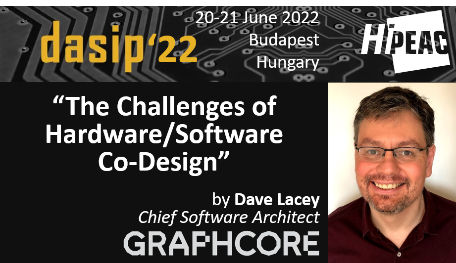
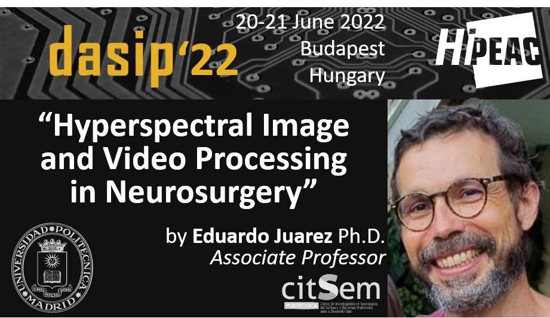

# DASIP 2022: Workshop on Design and Architectures for Signal and Image Processing in conjunction with the 17th HiPEAC Conference

~~**17-19 January 2022, Budapest, Hungary.**~~  
**Postponed to 20 – 22 June 2022, Budapest, Hungary**

The Workshop on Design and Architectures for Signal and Image Processing (DASIP) provides an inspiring international forum for the latest innovations and developments in the field of leading signal, image and video processing and machine learning in custom embedded, edge and cloud computing architectures and systems. The workshop program will include keynote speeches and contributed paper sessions. The 15th edition will be held in conjunction with the 17th HiPEAC Conference in Budapest, Hungary, June 20-22 2022.

## Table of Contents
- [List of topics](#list-of-topics)
- [Venue](#venue)
- [Contact](#contact)
- [Past events](#past-events)

## List of topics
Prospective authors are invited to submit manuscripts on topics including, but not limited to:

**Custom embedded, edge and cloud architectures and systems:**

* Machine learning and deep learning architectures for inference and training
* Systems for autonomous vehicles : cars, drones, ships and space applications
* Image processing and compression architectures
* Smart cameras, security systems, behaviour recognition
* Edge and cloud processing : special routing, configurable co-processors and low energy considerations
* Real-time cryptography, secure computing, financial and personal data processing
* Computer arithmetic, approximate computing, probabilistic computing, nanocomputing, bio-inspired computing
* Biological data collection and analysis, bioinformatics
* Personal digital assistants, natural language processing, wearable computing and implantable devices
* Global navigation satellite and inertial navigation systems*

**Design Methods and Tools:**

* Design verification and fault tolerance
* Embedded system security and security validation
* System-level design and hardware/software co-design
* High-level synthesis, logic synthesis, communication synthesis
* Embedded real-time systems and real-time operating systems
* Rapid system prototyping, performance analysis and estimation
* Formal models, transformations, algorithm transformations and metrics
 

**Development Platforms, Architectures and Technologies:**

* Embedded platforms for multimedia and telecommunication
* Many-core and multi-processor systems, SoCs, and NoCs  
* Reconfigurable ASIPs, FPGAs, and dynamically reconfigurable systems
* Memory system and cache management
* Asynchronous (self-timed) circuits and analog and mixed-signal circuits

## Paper submission​
Authors should submit their full papers (up to 12 pages, single-column Springer format) in PDF through the [EasyChair](https://easychair.org/conferences/?conf=dasip22) system. Please use the [Springer LNCS template](https://www.springer.com/gp/computer-science/lncs/conference-proceedings-guidelines) (also available on [Overleaf](https://urldefense.proofpoint.com/v2/url?u=https-3A__www.overleaf.com_latex_templates_springer-2Dlecture-2Dnotes-2Din-2Dcomputer-2Dscience_kzwwpvhwnvfj-23.WsdHOy5uZpg&d=DwMFAw&c=vh6FgFnduejNhPPD0fl_yRaSfZy8CWbWnIf4XJhSqx8&r=q7XC8ayAtvzwFbPyE97Vgp2UXTmCA0QuWwrKf0Qr1fYLUAeDZ76Jag2JYoy0eCtn&m=hfi97FbktcGY2h5JRa0DLIXUfWXtOgllrFA1GBl5XPM&s=CqZsHk_4e-pVlXa_XmXUEM95ZGyKiTfpq6wKcdHYtnQ&e=)).

Submitted papers are required to describe original  unpublished work and must not be under consideration for publication elsewhere. Submissions must be fully anonymous, but authors should not hide previous work, instead, they need to make self-references in the third person.
 
Each submission will receive at least three independent double blind reviews from the members of our scientific committee. Authors will be encouraged to take the reviewers’ comments into account when they prepare the final versions of their papers and present the research during the workshop prior to its publication. The conference proceedings will be published in the [Springer LNCS Series](https://www.springer.com/gp/computer-science/lncs), on the Springer Link website. Paper and keynote presentation slides and tutorial documents will be made available to workshop attendees after the workshop (subject to confidentiality issues). Authors of the best papers will be invited to submit an extended version of their work to  [Elsevier’s Journal of System Architecture (JSA)](https://www.journals.elsevier.com/journal-of-systems-architecture).

 
## Workshop format
We would like to propose a workshop format to have the research results presented with an in-depth scientific discussion without unnecessary time pressure:

* Presentation time 20 min + 5 min for questions and discussion,
* Two interesting keynote.

## Schedule
Keynote 1: **The Challenges of Hardware/Software Co-Design** – Dave Lacey, Graphcore (UK)

Keynote 2: **Hyperspectral Image and Video Processing in Neurosurgery** – Eduardo Juarez, UPM (Spain)

| **Mon. 20st** | **Sessions**                                                                                | **Title**                                                                                               |
|----------|-----------------------------------------------------------------------------------------|-----------------------------------------------------------------------------------------------------|
| **10:00**    | **Keynote 1**                                                                              | **“Welcome to DASIP22”** Karol Desnos (IETR) & Sergio Pertuz (TUD)                    |
| &nbsp;   | &nbsp;                                                                                  |  **“The Challenges of Hardware/Software Co-Design”** Dave Lancey (Graphcore) |
| **11:00**    | **Coffee break**                                                                            | &nbsp;                                                                                              |
| 11:30    | **Technical Session 1: Chair: Tomasz Kryjak (AGH)**                                                        |   &nbsp;                                |
| &nbsp;   | **Data-Type Assessment for Real-Time Hyperspectral Classification in Medical Imaging** | &nbsp;   |
| &nbsp;   | Manuel Villa, Jaime Sancho, Guillermo Vazquez, Gonzalo Rosa, Gemma Urbanos, Alberto Martin-Perez, Pallab Sutradhar, Ruben Salvador, Miguel Chavarrias, Alfonso Lagares, Eduardo Juarez and Cesar Sanz |
| &nbsp;   | **Exploring fully convolutional networks for the segmentation of hyperspectral imaging applied to advanced driver assistance systems**                                            |
| &nbsp;   | Jon Gutiérrez-Zaballa, Pablo Prieto López, Javier Echanobe, M. Victoria Martínez, Inés del Campo and Koldo Basterretxea                                                       |
| &nbsp;   | **An adaptable cognitive microcontroller node for fitness activity recognition**         |
| &nbsp;   | Matteo Antonio Scrugli, Bojan Blažica and Paolo Meloni.         |
| **13:00**    | **Lunch break**                                                                          | &nbsp; |
| 14:00    | **Technical Session 2: Chair: ?**                                                        |   &nbsp;                                |
| &nbsp;   | **High-Performance Gallager-E Decoders for Hard Input LDPC decoding on Multi-core Devices** | &nbsp;   |
| &nbsp;   | Bertrand Le Gal, Christophe Jégo and Vincent Pignoly. |
| &nbsp;   | **Low Latency Architecture Design for Decoding 5G NR Polar Codes**                                            |
| &nbsp;   | Oualid Mouhoubi, Charbel Abdel Nour and Amer Baghdadi                                                       |
| &nbsp;   | **Efficient Software and Hardware Implementations of a QCSP Communication System**         |
| &nbsp;   | Camille Monière, Bertrand Le Gal and Emmanuel Boutillon.         |
| **15:30**    | **Coffee break**                                                                            | &nbsp;                                                 |
| 16:00    | **Technical Session 3: Chair: Alfonso Rodriguez (UPM)**                                                        |   &nbsp;                                |
| &nbsp;   | **Influence of Dataflow Graph Moldable Parameters on Optimization Criteria** | &nbsp;   |
| &nbsp;   | Alexandre Honorat, Thomas Bourgoin, Hugo Miomandre, Karol Desnos, Daniel Menard and Jean-Francois Nezan. |
| &nbsp;   | **QoS aware design-time/run-time manager for FPGA-based embedded systems**                                            |
| &nbsp;   | Alexis Duhamel and Sebastien Pillement                                                       |
| &nbsp;   | **Fixed-Point Code Synthesis Based on Constraint Generation**         |
| &nbsp;   | Sofiane Bessaï, Dorra Ben Khalifa, Hanane Benmaghnia and Matthieu Martel.         |
| &nbsp;   | **Towards real-time and energy efficient Siamese tracking: a hardware-software approach**         |
| &nbsp;   | Dominika Przewłocka-Rus and Tomasz Kryja.         |
| **17:30**    | **End of first day**                                                                            | &nbsp;                                                 |

| **Tue. 21st** | **Sessions**                                                                                | **Title**                                                                                               |
|----------|-----------------------------------------------------------------------------------------|-----------------------------------------------------------------------------------------------------|
| **10:00**    | **Keynote 2**                                                                              | **"Hyperspectral Image and Video Processing in Neurosurgery”** Eduardo Juarez (UPM)                    |
| &nbsp;   | &nbsp;                                                                                  |
| **11:00**    | **Coffee break**                                                                            | &nbsp;                                                                                              |
| 11:30    | **Technical Session 1: Chair: Tomasz Kryjak (AGH)**                                                        |   &nbsp;                                |
| &nbsp;   | **Dynamic pruning for parsimonious CNN inference on embedded systems** | &nbsp;   |
| &nbsp;   | Paola Busia, Ilias Theodorakopoulos, Vasileios Pothos, Nikos Fragoulis and Paolo Meloni |
| &nbsp;   | **DL-CapsNet: A Deep and Light Capsule Network**                                            |
| &nbsp;   | Pouya Shiri and Amirali Baniasadi                                                       |
| &nbsp;   | **Comparative Study of Scheduling a Convolutional Neural Network on Multicore MCU**         |
| &nbsp;   | Petr Dobias, Thomas Garbay, Bertrand Granado, Khalil Hachicha and Andrea Pinna.         |
| **13:00**    | **End of DASIP22**                                                                          | **“Best Paper Award Announcement &amp; DASIP22 Closure”** Karol Desnos (IETR) &amp; Sergio Pertuz (TUD) |
| &nbsp;   |

### Accepted papers (first CfP):

* *QoS aware design-time/run-time manager for FPGA-based embedded systems*  
  Alexis Duhamel and Sebastien Pillement
* *DL-CapsNet: A Deep and Light Capsule Network*  
  Pouya Shiri and Amirali Baniasadi
* *High-Performance Gallager-E Decoders for Hard Input LDPC decoding on Multi-core Devices*  
  Bertrand Le Gal, Christophe Jégo and Vincent Pignoly.
* *Efficient Software and Hardware Implementations of a QCSP Communication System*  
  Camille Monière, Bertrand Le Gal and Emmanuel Boutillon
* *Dynamic pruning for parsimonious CNN inference on embedded systems*  
  Paola Busia, Ilias Theodorakopoulos, Vasileios Pothos, Nikos Fragoulis and Paolo Meloni
* *Data-Type Assessment for Real-Time Hyperspectral Classification in Medical Imaging*  
  Manuel Villa, Jaime Sancho, Guillermo Vazquez, Gonzalo Rosa, Gemma Urbanos, Alberto Martin-Perez, Pallab Sutradhar, Ruben Salvador, Miguel Chavarrias, Alfonso Lagares, Eduardo Juarez and Cesar Sanz
* *Low Latency Architecture Design for Decoding 5G NR Polar Codes*  
  Oualid Mouhoubi, Charbel Abdel Nour and Amer Baghdadi
* *An adaptable cognitive microcontroller node for fitness activity recognition*  
  Matteo Antonio Scrugli, Bojan Blažica and Paolo Meloni
* *Exploring fully convolutional networks for the segmentation of hyperspectral imaging applied to advanced driver assistance system*s  
  Jon Gutiérrez-Zaballa, Pablo Prieto López, Javier Echanobe, M. Victoria Martínez, Inés del Campo and Koldo Basterretxea

### Accepted papers (second CfP):

* *Comparative Study of Scheduling a Convolutional Neural Network on Multicore MCU*  
Petr Dobias, Thomas Garbay, Bertrand Granado, Khalil Hachicha and Andrea Pinna.
* *Influence of Dataflow Graph Moldable Parameters on Optimization Criteria*  
Alexandre Honorat, Thomas Bourgoin, Hugo Miomandre, Karol Desnos, Daniel Menard and Jean-Francois Nezan.
* *Fixed-Point Code Synthesis Based on Constraint Generation*  
Sofiane Bessaï, Dorra Ben Khalifa, Hanane Benmaghnia and Matthieu Martel.
* *Towards real-time and energy efficient Siamese tracking: a hardware-software approach,*  
Dominika Przewłocka-Rus and Tomasz Kryjak

## DASIP22 Best Paper Award
**“Efficient Software and Hardware Implementations of a QCSP Communication System”**
Camille Monière, Bertrand Le Gal and Emmanuel Boutillon

## Important dates
* Abstract submission deadline: ~~November 5th, 2021~~ November 15th, 2021
* Paper submission deadline: ~~November 12th, 2021~~ **(Extended) November 21st, 2021,**
* Notification of acceptance: ~~December 20th, 2021,~~
* Camera ready papers: ~~January 7th, 2022~~
* Workshop: ~~January 20-22, 2022~~

## 2nd Call for papers
* Abstract deadline: ~~March 28th, 2022~~ **Until Submission deadline**
* Submission deadline: ~~April 04th, 2022~~ **(Extended) April, 17th, 2021**
* Notification: May 23rd, 2022
* Camera ready: June 10th, 2022
* Workshop: June 20-21, 2022*

[Fall call for papers (pdf)](CFP_DASIP_2022_PDF_0_2.pdf)

## Committees
**Steering Committee:**
  
* Bertrand Granado, Sorbonne Univeristy, France
* Diana Goehringer, Technical University of Dresden, Germany
* Eduardo de La Torre, Polytechnic University of Madrid, Spain
* Guy Gogniat, University of Southern Brittany, France
* Jean-Francois Nezan, INSA Rennes/ IETR laboratory, France
* Jean-Pierre David, Polytechnique Montréal, Canada
* Joao M. P. Cardoso, University of Porto, Portugal
* Marek Gorgon, AGH University of Science and Technology, Poland
* Michael Huebner, Brandenburg University of Technology, Germany
* Paolo Meloni, University of Cagliari, Italy
* Pierre Langlois, Polytechnique Montréal, Canada
* Sebastien Pillement, University of Nantes, France
* Tomasz Kryjak, AGH University of Science and Technology, Poland

**Organising committee:**

* Karol Desnos, IETR, Rennes, France
* Sergio Pertuz, Technical University Dresden, Germany

**Technical Program Committee:**

* Francois Berry, Institut Pascal – CNRS, France
* Arnaud  Bourge, STMicroelectronics, France
* Jani Boutellier, University of Vaasa, Finland
* Gabriel Caffarena, University CEU San Pablo, Spain
* Joao M. P. Cardoso, University of Porto, Portugal
* Juan Carlos Lopez, University of Castilla-La Mancha, Spain
* Daniel Chillet, IRISA/ENSSAT, University of Rennes 1
* Martin Danek, Daiteq s.r.o.. Czechia
* Eduardo de La Torre, Polytechnic University of Madrid, Spain
* Karol Desnos, INSA Rennes/ IETR laboratory, France
* Milos Drutarovsky, Technical University of Kosice, Slovak Republic
* Joao Canas Ferreira, University of Porto, Portugal
* Jean Francois Nezan, INSA Rennes/ IETR laboratory, France
* Diana Goehringer, Technical University of Dresden, Germany
* Guy Gogniat, University of Southern Brittany, France
* Marek Gorgon, AGH University of Science and Technology, Poland
* Bertrand Granado, Sorbonne University, France
* Oscar Gustafsson, Linkoping University, Sweden
* Frank Hannig, University of Erlangen-Nurnberg, Germany
* Dominique Houzet, Grenoble Institute of Technology
* Michael Huebner, Brandenburg University of Technology, Germany
* Mateusz Komorkiewicz, Aptive, Poland
* Tomasz Kryjak, AGH University of Science and Technology, Poland
* Lionel Lacassagne, Sorbonne Universite, France
* Ahmed Lakhssassi, Universite du Quebec en Outaouais
* Pierre Langlois, Polytechnique Montréal, Canada
* Yannick Le Moullec, Tallinn University of Technology, Estonia
* Johan Lilius, Abo Akademi University, Finland
* Sebastian Lopez, University of Las Palmas de Gran Canaria, Spain
* Gustavo  Marrero Callico, University of Las Palmas de Gran Canaria, Spain
* Kevin J.M. Martin, University of Southern Brittany, France
* Paolo Meloni, University of Cagliari, Italy
* Gabriela Nicolescu, Polytechnique Montréal, Canada
* Jari Nurmi, Tampere University, Finland
* Arnaldo Oliveira, University of Aveiro, Portugal
* Andres Otero, Polytechnic University of Madrid, Spain
* Francesca Palumbo, University of Sassari
* Maxime Pelcat, INSA Rennes/ IETR laboratory, France
* Fernando Pescador, Polytechnic University of Madrid, Spain
* Jean Pierre David, Polytechnique Montréal, Canada
* Christian Pilato, Polytechnic University of Milan
* Sebastien Pillement, University of Nantes, France
* Andrea Pinna, Sorbonne University, France
* Jorge Portilla, Polytechnic University of Madrid, Spain
* Alfonso Rodriguez, Polytechnic University of Madrid
* Nuno Roma, University of Lisbon, Portugal
* Olivier Romain, University of Cergy Pontoise, France
* Paweł Russek, AGH University of Science and Technology, Poland
* Ruben Salvador, CentraleSupélec, France
* Carlo Sau, University of Cagliari
* Yves Sorel, INRIA, France
* Dimitrios Soudris, National Technical University of Athens
* Walter Stechele, Technical University of Munich, Germany
* Marcin  Szelest, Aptive, Poland
* Claude Thibeault, Ecole de Technologie Superieure, Canada
* Jose Vieira, University of Aveiro, Portugal
* Tanya Vladimirova, University of Leicester, UK
* Serge Weber, University of Lorraine, France

## Venue
The Workshop on Design and Architectures for Signal and Image Processing will be held in conjunction with the [17th HiPEAC Conference](https://www.hipeac.net/2022/budapest/#/) in Budapest, Hungary, January 20-22, 2022.

## Contact
All questions about the workshop and submissions should be emailed to [Karol Desnos](mailto:karol.desnos@insa-rennes.fr) or [Sergio Pertuz ](mailto:sergio.pertuz@tu-dresden.de)

## Past events
* [DASIP 2021 (14th), In conjunction with the 16th HiPEAC Conference in Budapest, Hungary](http://dasip2021.agh.edu.pl/)
* [DASIP 2019 (13th), Polytechnique Montréal, Canada](https://dasip2019.gr2m.polymtl.ca/)
* [DASIP 2018 (12th), University of Porto, Portugal](https://web.fe.up.pt/~specs/events/dasip2018/)
* DASIP 2017 (11th), Technical University of Dresden, Germany
* DASIP 2016 (10th), RISA/INRIA Rennes, France,
* DASIP 2015 (9th), AGH University of Science and Technology, Krakow, Poland
* DASIP 2014 (8th), Autonomous University of Madrid, Spain
* DASIP 2013 (7th), University of Cagliari, Italy
* DASIP 2012 (6th), Karlsruhe Institute of Technology, Germany
* DASIP 2011 (5th), Tampere University of Technology, Finland
* DASIP 2010 (4th), University of Edinburgh, UK
* DASIP 2009 (3rd), Sophia Antipolis, France
* DASIP 2008 (2nd), Brussels, Belgium
* DASIP 2007 (1st), Grenoble, France